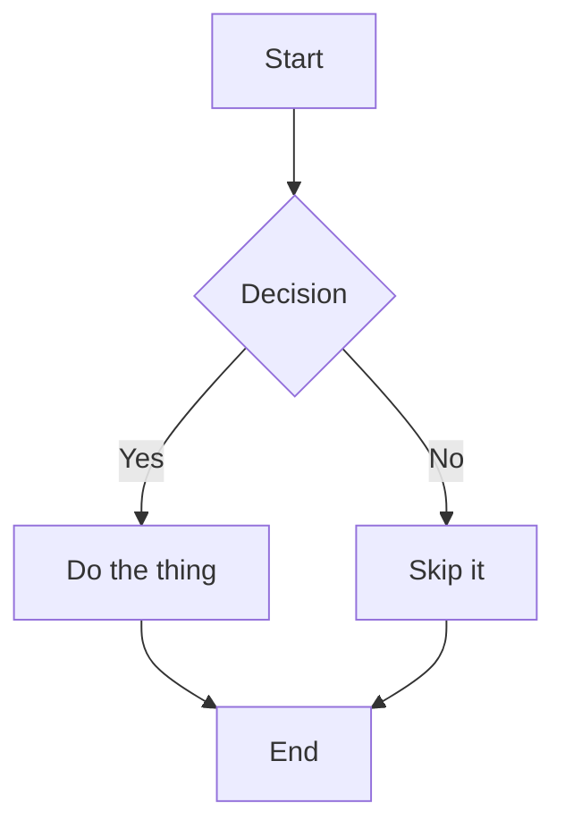
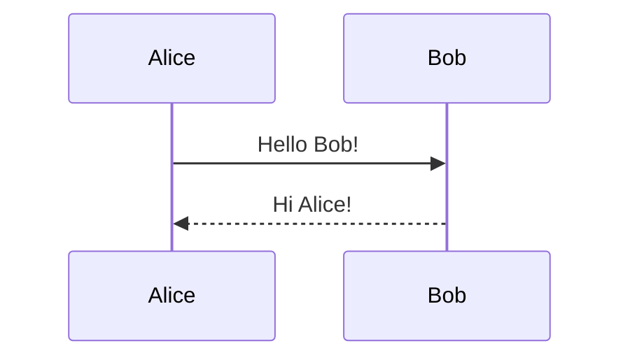

# MDEditor — Lightweight Markdown Editor & Viewer

A single-file desktop application for Windows 11 that lets you write, preview, and export Markdown documents. Built with Python and PySide6 (Qt6).

---

## Feature Overview

| Feature | Details |
|---|---|
| **Split live preview** | Editor and rendered preview side by side, updates as you type |
| **Syntax highlighting** | Headings, bold, italic, links, code spans, math, lists, and more |
| **File browser sidebar** | Navigate and open `.md` files from any folder |
| **Find & Replace** | Case-sensitive, regex, wrap-around, replace one or all |
| **Dark / Light mode** | Full theme toggle for the editor, sidebar, and preview |
| **PDF export** | One-click export to a styled, print-ready PDF |
| **Tables** | GitHub-Flavored Markdown tables |
| **Code block highlighting** | Auto language detection via highlight.js |
| **Math / LaTeX** | Inline `$...$` and display `$$...$$` via KaTeX |
| **Mermaid diagrams** | Flowcharts, sequence diagrams, Gantt charts in fenced blocks |

---

## Prerequisites

| Requirement | Version | Notes |
|---|---|---|
| Windows 11 | Any current build | Also works on Windows 10 |
| Python | 3.11 or newer | 3.12 recommended |
| pip | Comes with Python | Used to install dependencies |
| Internet | On first preview load | For CDN-served JS libraries (highlight.js, KaTeX, Mermaid) |

---

## Setup Guide

### Step 1 — Install Python

1. Open a browser and go to **https://www.python.org/downloads/**
2. Click **Download Python 3.x.x** (the big yellow button).
3. Run the installer.
4. **Important:** on the first screen, tick **"Add python.exe to PATH"** before clicking Install Now.
5. Once complete, open **Command Prompt** (`Win + R` → type `cmd` → Enter) and verify:

```cmd
python --version
```

You should see something like `Python 3.12.3`. If you see an error, restart your computer and try again.

---

### Step 2 — Get the project files

**Option A — If you have Git installed:**

```cmd
git clone https://github.com/ouzayr/Utilities.git
cd Utilities\MDEditor
```

**Option B — Download as a ZIP:**

1. Go to the repository page on GitHub.
2. Click the green **Code** button → **Download ZIP**.
3. Extract the ZIP.
4. Navigate into the extracted folder, then into the `MDEditor` subfolder.

---

### Step 3 — Install dependencies

Open Command Prompt **inside the `MDEditor` folder**, then run:

```cmd
pip install -r requirements.txt
```

This installs:
- `PySide6` — the Qt6 GUI framework (includes the Chromium web engine for preview)
- `markdown` — the Python Markdown parser

Installation typically takes 1–3 minutes depending on your connection speed. PySide6 is around 200 MB.

> **Tip:** If `pip` is not found, try `python -m pip install -r requirements.txt` instead.

---

### Step 4 — Run the application

From the `MDEditor` folder:

```cmd
python markdown_editor.py
```

The application window will open immediately. You can also open a specific file on launch:

```cmd
python markdown_editor.py "C:\Users\YourName\Documents\notes.md"
```

---

### Step 5 (Optional) — Build a standalone .exe

If you want a double-clickable `.exe` that does not require Python to be installed on the target machine:

1. Double-click `build.bat` inside the `MDEditor` folder, **or** run from Command Prompt:

```cmd
build.bat
```

2. Wait for PyInstaller to finish (2–5 minutes on first build).
3. The executable will appear at:

```
MDEditor\dist\MarkdownEditor.exe
```

You can copy this single file anywhere — a USB drive, another Windows PC, etc. — and run it without installing Python or any libraries.

> **Note:** The `.exe` will be approximately 150–200 MB because it bundles a stripped-down Chromium engine for the preview panel. This is expected behaviour for PySide6 applications.

---

## Using the Application

### Layout

```
┌─────────────┬────────────────────────┬────────────────────────┐
│ File Browser│      Editor            │      Live Preview      │
│  (sidebar)  │  (raw Markdown text)   │  (rendered HTML)       │
│             │                        │                        │
│ Navigate    │ Type here. Syntax      │ Updates ~350 ms after  │
│ folders and │ highlighting applies   │ you stop typing.       │
│ open .md    │ in real time.          │ Scrolls independently. │
│ files.      │                        │                        │
└─────────────┴────────────────────────┴────────────────────────┘
```

Drag the vertical dividers to resize any panel. Panels can be hidden from the **View** menu.

---

### Keyboard Shortcuts

| Action | Shortcut |
|---|---|
| New file | `Ctrl + N` |
| Open file | `Ctrl + O` |
| Open folder in sidebar | `Ctrl + Shift + O` |
| Save | `Ctrl + S` |
| Save As | `Ctrl + Shift + S` |
| Export PDF | `Ctrl + Shift + E` |
| Find & Replace | `Ctrl + F` |
| Toggle sidebar | `Ctrl + B` |
| Toggle preview panel | `Ctrl + Shift + P` |
| Toggle Dark / Light mode | `Ctrl + Shift + D` |
| Undo | `Ctrl + Z` |
| Redo | `Ctrl + Y` |
| Quit | `Alt + F4` |

---

### Writing Markdown

The editor supports standard Markdown syntax plus several extensions:

**Basic formatting**

```markdown
# Heading 1
## Heading 2
### Heading 3

**Bold text**    *Italic text*    ~~Strikethrough~~

> Blockquote paragraph

- Unordered list item
1. Ordered list item

[Link text](https://example.com)

```

**Tables**

```markdown
| Column A | Column B | Column C |
|----------|----------|----------|
| Cell 1   | Cell 2   | Cell 3   |
| Cell 4   | Cell 5   | Cell 6   |
```

**Code blocks with language highlighting**

````markdown
```python
def greet(name: str) -> str:
    return f"Hello, {name}!"
```

```javascript
const greet = name => `Hello, ${name}!`;
```
````

Supported languages include: Python, JavaScript, TypeScript, HTML, CSS, JSON, SQL, Bash, C, C++, Java, Go, Rust, and [many more](https://highlightjs.org/download/).

**Math / LaTeX**

```markdown
Inline math: $E = mc^2$

Display math:
$$
\int_{-\infty}^{\infty} e^{-x^2} dx = \sqrt{\pi}
$$
```

**Mermaid diagrams**

````markdown



````

> **Requires internet:** Mermaid, KaTeX, and highlight.js are loaded from CDN on first render. Once loaded, they are cached by the embedded browser for the session.

---

### Exporting to PDF

1. Finish writing your document.
2. Press `Ctrl + Shift + E` or go to **File → Export PDF…**
3. Choose where to save the file and click **Save**.
4. A status bar message confirms when the PDF has been written.

The PDF is rendered directly from the live preview, so it includes all styling — dark or light theme, syntax highlighting, tables, diagrams, and math.

---

## Troubleshooting

**"python is not recognized"**
Python was not added to PATH during installation. Re-run the Python installer, choose **Modify**, and tick **Add Python to environment variables**.

**Preview panel is blank / all white**
The Chromium WebEngine may need GPU acceleration disabled on some systems. Set this environment variable before launching:

```cmd
set QTWEBENGINE_CHROMIUM_FLAGS=--disable-gpu
python markdown_editor.py
```

**Mermaid / KaTeX / highlight.js not rendering**
These libraries load from CDN. Check your internet connection. If you are behind a corporate proxy, you may need to configure proxy settings.

**Build fails with "RecursionError"**
Add `--recursion-limit 5000` to the PyInstaller command in `build.bat`.

**The .exe is flagged by antivirus**
PyInstaller-packaged executables are sometimes flagged by heuristic antivirus scanners because they bundle a Python interpreter. The file is safe — you can add an exclusion in Windows Security, or run from source instead.

---

## Project Structure

```
MDEditor/
├── markdown_editor.py   # Entire application — ~700 lines of Python
├── requirements.txt     # pip dependencies
├── build.bat            # Windows build script (produces dist\MarkdownEditor.exe)
└── README.md            # This file
```

---

## Dependencies

| Package | Version | Licence | Purpose |
|---|---|---|---|
| PySide6 | ≥ 6.6 | LGPL v3 | GUI framework (Qt6 + Chromium WebEngine) |
| markdown | ≥ 3.5 | BSD | Markdown-to-HTML parser |
| highlight.js | 11.9 (CDN) | BSD | Code syntax highlighting in preview |
| KaTeX | 0.16 (CDN) | MIT | LaTeX math rendering in preview |
| Mermaid | 10.x (CDN) | MIT | Diagram rendering in preview |

All Python packages are installed locally into your Python environment — nothing is installed system-wide.
